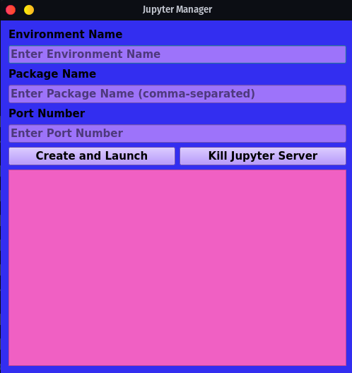

# Jupyter Manager

Jupyter Manager is a graphical application built using PyQt5 that simplifies the process of creating and launching Jupyter Notebook environments. It provides a user-friendly interface to configure virtual environments, install packages, and start Jupyter Notebook servers.

## Prerequisites

Before using Jupyter Manager, make sure you have the following prerequisites installed on your system:

- Python 3.x
- PyQt5
- colorama

## Installation

1. Clone the repository to your local machine:

```bash
git clone https://github.com/your_username/your_repository.git
```

2. Install the required dependencies using pip:

```bash
pip install PyQt5 colorama
```

## Usage

1. Run the application by executing the following command:

```bash
python jupyter_manager.py
```

2. The Jupyter Manager window will appear with the following fields:

   - **Environment Name**: Enter the name for your virtual environment.
   - **Package Name**: Enter the packages you want to install (comma-separated).
   - **Port Number**: Enter the port number for the Jupyter Notebook server.

3. Click on the "Create and Launch" button to create the virtual environment, activate it, install the specified packages, and launch the Jupyter Notebook server.

4. The application will display status messages and progress updates in the text output field. You can view the Jupyter Notebook by opening a web browser and navigating to `http://localhost:<port_number>`.

5. To stop the Jupyter Notebook server, click on the "Kill Jupyter Server" button.

## Contributing

Contributions are welcome! If you have any ideas, bug fixes, or improvements, please submit a pull request.

## License

This project is licensed under the MIT License. See the [LICENSE](LICENSE) file for details.

